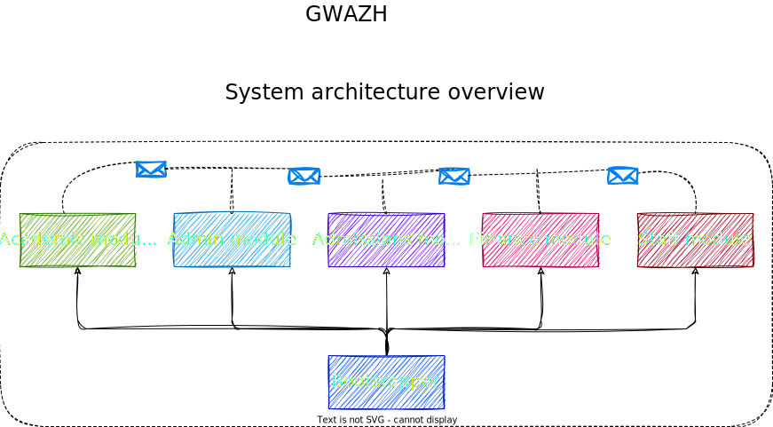

# Gwazh: Modular Monolith

Gwazh is a fictitious school system built as a modular monolith. A modular monolith is a design approach that combines the best of monolithic and microservices architectures. The monolithic application is broken down into loosely-coupled components (modules), which are still deployed as a single unit.

> [!NOTE]
> It is advisable to start off with a modular monolith before going to microservices. This will give you the flexibility to gradually evolve into a microservices architecture once you have observed your system and identified components that could benefit from being extracted into separate services.

## System architecture overview

The Gwazh system was designed as modular monolith with the following characteristics:

- All modules are class libraries, they are not executable on their own.
- `Bootstrapper` is responsible for putting everything together and expose the API as one single unit.
- No direct dependency between modules, except for message contracts.
- Modules communicate with each other indirectly using messages (events). For starters, this will still be in-process. A message broker is going to be added eventually to make the communication asynchronous.
- Modules don't share database schemas (some will have different databases altogether).

## Advantages

1. **Simplicity of Development**: Modular monoliths are easier to develop and maintain than full-blown microservices architectures. Developers work with a single codebase, simplifying deployment and debugging.
2. **Easier Testing**: Unit and integration testing can be simpler in a monolithic codebase compared to microservices, as there's no need to mock external service dependencies.
3. **Lower Operational Overhead**: Managing a single application is generally less complex than managing a fleet of microservices. This reduces operational overhead. This is especially true when there is one team managing multiple microservices.
4. **Performance**: Since all components live in a single process, communication between them is faster since there are no network calls.

## Disadvantages

1. **Limited Scalability**: Modular monoliths are not as scalable as pure microservices architectures. You may face limitations in horizontal scaling, and scaling may be less flexible.
2. **Technological Heterogeneity**: It can be challenging to incorporate different technologies or languages within a single codebase, as all modules share the same runtime environment.
3. **Longer Deployment Cycles**: Because all modules are deployed together, any changes require deploying the entire application. This can lead to longer deployment cycles.
